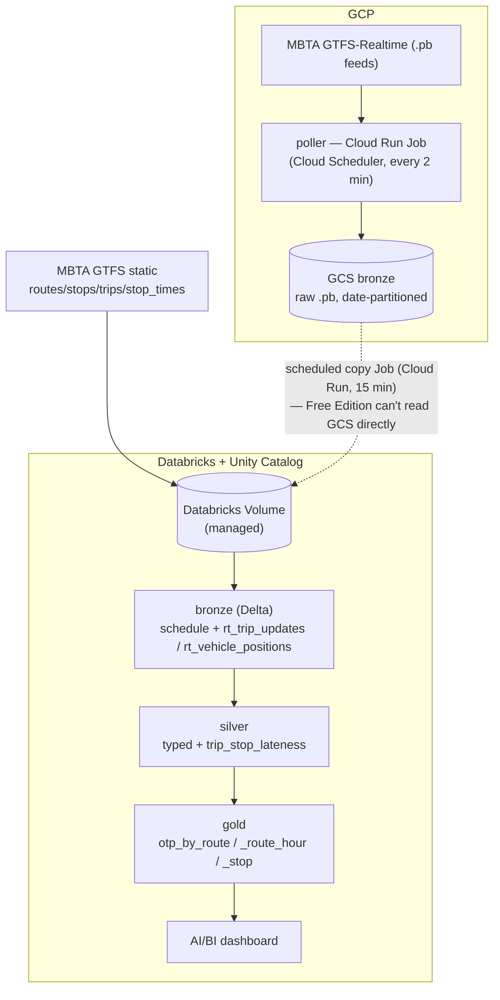

# MBTA On-Time Lakehouse

> **Is the train late, and why?** — an end-to-end lakehouse that ingests the MBTA's live
> transit feed, measures **on-time performance (OTP)**, and surfaces *where delays
> concentrate* — built on **GCP + Databricks**, **reproducible from code**.

**Status: working end-to-end.** GTFS static + live GTFS-Realtime → bronze → silver
(lateness) → gold (OTP) → an AI/BI dashboard, with a scheduled cloud poller building real
history. Built CLI-first; every notebook is idempotent and data-quality-gated.

---

## The problem
A transit-ops team needs to know not just *that* trains are late, but **where lateness
concentrates** across routes and stops — so they know where to intervene.

- **Stakeholder:** MBTA ops manager · **Metric:** OTP % by route / stop / hour · **Cadence:** near-real-time

## What it shows (sample)
On a short capture window: **system-wide OTP ≈ 64%** (on-time = −1..+5 min); worst routes the
**E line (~14%)** and route 66; delays concentrate at stops like **Davis** and **Alewife**.
*(Numbers are illustrative until the scheduled poller accumulates days of history — the
computation is the deliverable; more data just sharpens it.)*

## Architecture



> **Split of responsibilities:** GCP owns ingestion + raw object storage; Databricks owns the
> medallion, governance (Unity Catalog), and serving. The dashed hop is a real Free-Edition
> constraint, documented in [decisions](docs/architecture.md).

## Stack (what's actually built)

| Concern | Choice |
|---|---|
| Raw RT landing | **GCS** (date-partitioned `.pb`) |
| Scheduled ingestion | **Cloud Run Job + Cloud Scheduler** (containerized poller) |
| Lakehouse / compute | **Spark on Databricks (Free Edition)**, **Delta**, **Unity Catalog** |
| Modeling | medallion bronze → silver → gold; **explicit schemas**, idempotent overwrite |
| Serving | **Databricks AI/BI dashboard** (as code, `dashboards/otp.lvdash.json`) |
| IaC | **Terraform** (GCP provider; GCS-backed remote state) |
| Toolchain | **mise**-pinned (`gcloud`/`terraform`/`databricks`/`python`/`uv`) |
| Provisioned for next | **Pub/Sub** topic (true streaming path), GitHub Actions CI |

## Engineering principles
- **Reproducible from code** — infra (Terraform), pipelines (notebooks), dashboard (JSON), all version-controlled and CLI-deployable.
- **Idempotent** — re-runs/backfills never duplicate (timestamped object names; Delta overwrite).
- **Data-quality gates** — every notebook `assert`s (non-empty, uniqueness, referential integrity, OTP bounds) so bad data **fails the job** instead of leaking downstream.
- **Cost discipline** — serverless/job compute, auto-terminate, `force_destroy` buckets, a 2-min cadence well within free credits.

## Repo tour
```
databricks/notebooks/   01_bronze · 02_silver · 03_bronze_rt · 04_silver_lateness · 05_gold_otp
src/ingestion/          gtfs_rt_poller.py  (I/O separated from pure logic; unit-tested)
terraform/              GCS + Pub/Sub + Cloud Run Job + Cloud Scheduler + IAM
dashboards/             otp.lvdash.json  (AI/BI dashboard as code)
docs/                   concepts.md · architecture.md (decisions) · design-patterns.md
tests/                  pytest (pure-logic + smoke)
```

## Reproduce
```bash
mise install                 # pinned gcloud/terraform/databricks/python/uv
uv sync                      # python deps
terraform -chdir=terraform init && terraform -chdir=terraform apply   # GCP infra
# build + push poller image, then the notebooks run on Databricks (see docs/architecture.md)
```
> Secrets live in `.env` (gitignored) / GCP / GitHub Actions secrets — **never committed.**

## Docs
- **[Concepts & glossary](docs/concepts.md)** — RT, time series, medallion, partitioning, idempotency, silver-vs-gold.
- **[Architecture & hard decisions](docs/architecture.md)** — the design calls + why (interview ammo).
- **[Design patterns](docs/design-patterns.md)** — reusable patterns this project produced.

## What's done vs. next
- ✅ Bronze + silver + gold medallion (5 idempotent, DQ-gated notebooks), real OTP
- ✅ Scheduled cloud ingestion (Cloud Run Job + Scheduler, every 2 min) building history
- ✅ **Self-refreshing loop** — a GCS→Volume **copy Job** (Cloud Run, every 15 min) + a scheduled **Databricks Job** chaining 03→04→05 (hourly), so OTP rebuilds from new data automatically
- ✅ AI/BI dashboard as code
- ⬜ GitHub Actions CI (tests + DQ on PR; `terraform plan→apply` gating)
- ⬜ True streaming path (Pub/Sub → Structured Streaming); a paid workspace would allow Databricks to read GCS directly (vs. the copy Job)

## Data source
MBTA V3 API / GTFS-Realtime — https://www.mbta.com/developers (public, free).

---
*A data-engineering portfolio project. Built CLI-first with Claude Code.*
