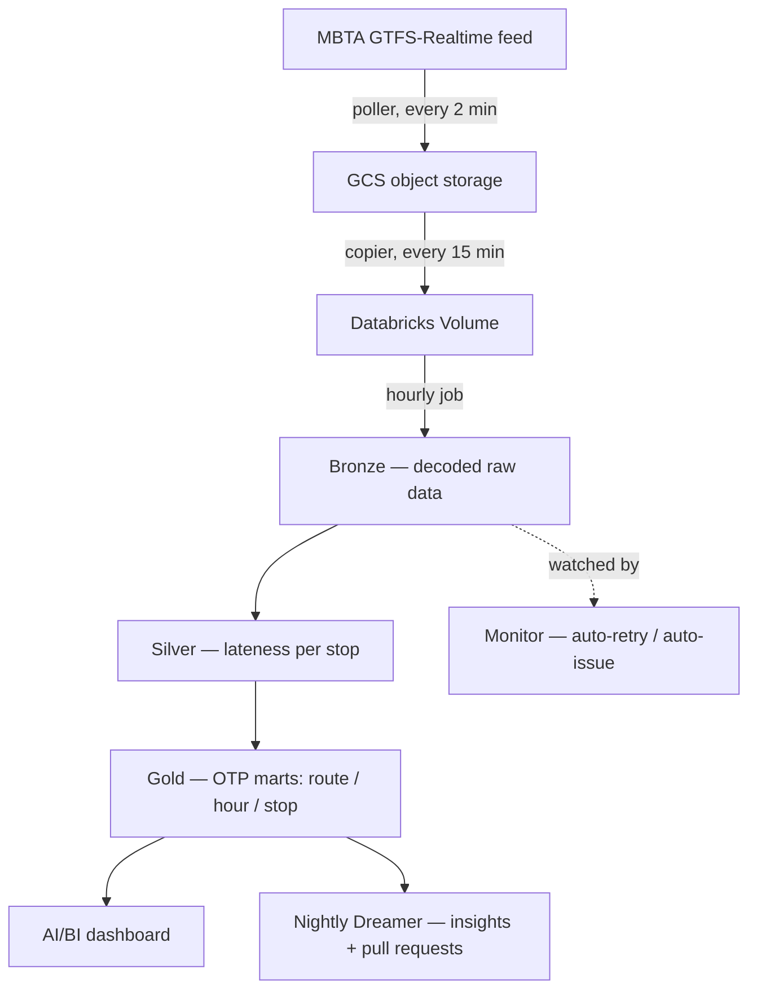

# How it works

In plain English, then with the picture.

## The kitchen analogy

Think of it as a restaurant kitchen turning raw ingredients into a finished dish:

- **Raw ingredients** — the MBTA's live data, grabbed every couple of minutes.
- **Prepped** — for each stop, *how late was it?* (real arrival vs. the timetable).
- **Plated dish** — the on-time-performance scoreboard you can actually read.

Each step runs on a schedule. Nobody presses a button.

## The pipeline

## The medallion: Bronze → Silver → Gold

A standard, interview-friendly layout where data gets more refined at each layer:

- **Bronze (raw):** decode the MBTA's protobuf snapshots into tables — exactly as received.
- **Silver (cleaned):** the heart of it — join real-time arrivals to the schedule and compute
  **minutes late** per trip and stop. The hard part: real-time times are absolute UTC instants,
  while the schedule is local time-of-day that can exceed `24:00:00` (after-midnight buses). Get
  that reconciliation wrong and every number is quietly off — so it's covered by tests.
- **Gold (business-ready):** the answer, as three marts —
  *OTP by route* (the scorecard), *OTP by route × hour* (when does it degrade?), and
  *OTP by stop* (where do delays concentrate?).

## "On time" is a decision

There's no universal definition of "on time." Here a stop counts as on-time if it's within a
tunable band (e.g. **−1 to +5 minutes**) — early beyond that is *early*, later is *late*. Making
that explicit and configurable is part of treating OTP as a real product metric.

## The moving parts

| Piece | What it does | Cadence |
|---|---|---|
| Poller | MBTA live feed → cloud storage | every 2 min |
| Copier | cloud storage → Databricks (incremental) | every 15 min |
| Medallion job | Bronze → Silver → Gold | hourly |
| Dreamer | reads Gold → insight → pull request | nightly |
| Monitor | checks the job; retries or files a ticket | every 30 min |

The last two make it **self-managing** — see [Under the hood](under-the-hood.md).
