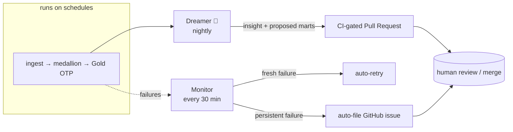
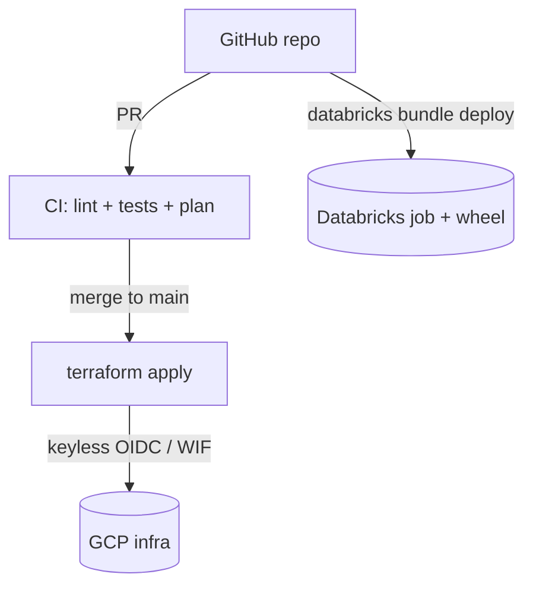

# Under the hood

What makes this more than a pipeline: it operates and improves itself, it's reproducible from
code, and its logic is tested.

## The self-managing loop (agentic)

Two agents close the loop:

- **The Dreamer** (sleep-time compute). Each night it reads the Gold marts, detects what's notable
  (late/early routes, problem corridors), **verifies** findings, narrates them in plain English via
  an LLM, and **learns a drift-guarded baseline** of "what's normal." Its output is a **pull
  request** with the insight and proposed new metrics — never an automatic change.
- **The Monitor** (self-healing). Every 30 minutes it inspects the medallion job's run history. A
  *fresh* failure is **auto-retried**; a *persistent* one becomes a **deduplicated GitHub issue**.

### Tiered autonomy

The system is autonomous *within guardrails*:

| Tier | What | How it acts |
|---|---|---|
| **1 — safe / reversible** | retries, baseline updates, incremental copy | **automatic** |
| **2 — consequential** | new metrics, schema/logic changes | **auto-proposed as a PR** → human merges |
| **3 — risky** | anything that could corrupt data or spend unbounded | **never automatic** |

This is deliberate: verification is the hard part of autonomy, so consequential changes always pass
a human gate. (It earned its keep early — when an out-of-memory bug appeared at real data volume,
the Monitor caught it automatically.)

## Everything is code (reproducible)

Two infrastructure-as-code layers, each native to its platform:

- **Terraform** owns **GCP** — object storage, Cloud Run jobs, schedulers, secrets, IAM.
- **Databricks Asset Bundles** own **Databricks** — the medallion job, the notebooks, and the
  tested transform **wheel** the notebooks import.

CI runs unit + Spark integration tests on every change, and gates `terraform plan → apply` using
**Workload Identity Federation** — GitHub presents a short-lived OIDC token that GCP exchanges for
temporary credentials. **No service-account keys are stored anywhere.**

## Tested logic (not tested copies)

The trickiest silver/gold logic lives in one small library, exercised on a **real local Spark
session** — including the after-midnight wrap and the OTP band. That library is packaged as a
dependency-free **wheel** that the production notebooks import, so **the code that's tested is the
code that runs** (no drift between "the tests" and "the pipeline").

## Cost-aware by design

Databricks **Free Edition** + GCP free credits, **serverless** throughout, schedules pausable on
demand. The whole system runs for roughly the price of nothing.

> Want the streaming chapter? See the [Roadmap](roadmap.md) — incremental ingestion via Structured
> Streaming + Auto Loader is the next build.
